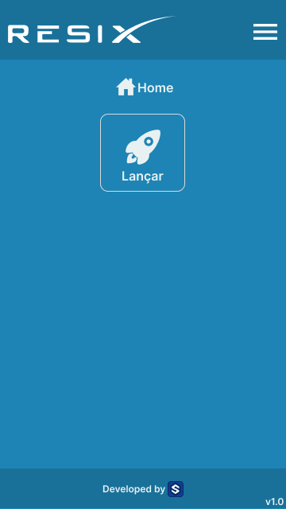
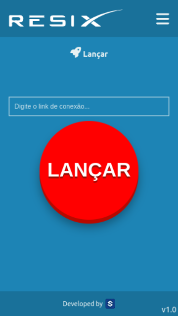

# RESIX

> Primeiro app em react! Projeto criado com a finalidade de lançar fogos de artifício para o Nodemcu (Demostração de vídeo em breve) 

### Dependências & Tecnologias

- [x] React Router DOM
- [x] Font Awesome 
- [x] Fetch API
- [x] Confetti

## :camera: Imagens do projeto (Alguns criados via Figma)

## 💻 Fontes

Algumas fontes (videoaulas, tutoriais e documentações) ultilizadas para a criação
* React Crash Course (uma visão geral sobre o react) https://www.youtube.com/watch?v=w7ejDZ8SWv8
* React Router DOM https://www.youtube.com/watch?v=UjHT_NKR_gU
* sobre JSX https://reactjs.org/docs/introducing-jsx.html
* Sobre useState https://www.youtube.com/watch?v=O6P86uwfdR0

